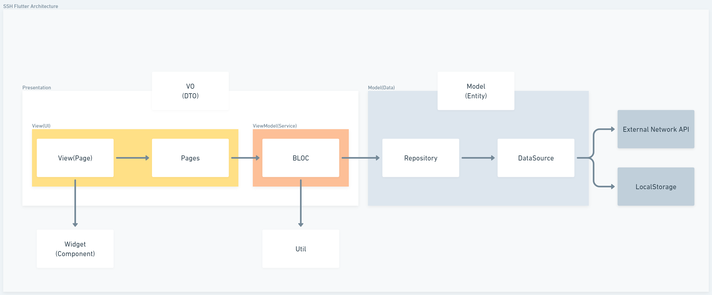

# dart_flutter

Flutter 3.10.0
Dart 3.0



```python
# 폴더구조
📂lib
└ ✨main.dart
└ 📂res
└ 📂src
  └ 📂data
    └ 📂model
    └ 📂repository
  └ 📂datasource
  └ 📂presentation
    └ 📂features ...
      └ ✨pages
      └ ✨view
      └ ✨view_model
  └ 📂util
  └ 📂widget
    └ ✨components ...
📂test
└ ✨... 
📂assets
  └ 📂images
  └ 📂fonts
```


<br/>
<br/>
<br/>

## Env

| No. | FileName | path | desc. |
| --- | --- | --- | --- |
| 0 | environment_local.dart | /lib/res/environment |  |
| 1 | environment_dev.dart | /lib/res/environment |  |
| 2 | environment_prod.dart | /lib/res/environment |  |
| 3 | environment_stage.dart | /lib/res/environment |  |
| 4 | firebase_options.dart | /lib |  |
| 5 | google-services.json | /android/app |  |
| 6 | upload_certificate.pem | /android |  |


<br/>
<br/>
<br/>

## flutter 빌드 명령어 모음

```python
--dart-define=BUILD_TYPE=prod

flutter build ipa --dart-define "BUILD_TYPE=prod"

flutter run -d 'iPhone 14 Pro Max' --dart-define "BUILD_TYPE=dev"

flutter run --release -d '이승열의 iPhone' --dart-define "BUILD_TYPE=dev"
flutter run --release -d '최현식의 iPhone' --dart-define "BUILD_TYPE=dev"

flutter build appbundle --dart-define=BUILD_TYPE=prod

flutter build apk --debug --target-platform=android-arm64

flutter build apk --dart-define=BUILD_TYPE=prod
```

## 스토어 업데이트 참고

[Previewed - Free mockup generator for your app](https://previewed.app/)

[스크린샷 사양 - 참고 - App Store Connect - 도움말 - Apple Developer](https://developer.apple.com/kr/help/app-store-connect/reference/screenshot-specifications/)

[앱 및 제출 상태 - 참고 - App Store Connect - 도움말 - Apple Developer](https://developer.apple.com/kr/help/app-store-connect/reference/app-and-submission-statuses/)
